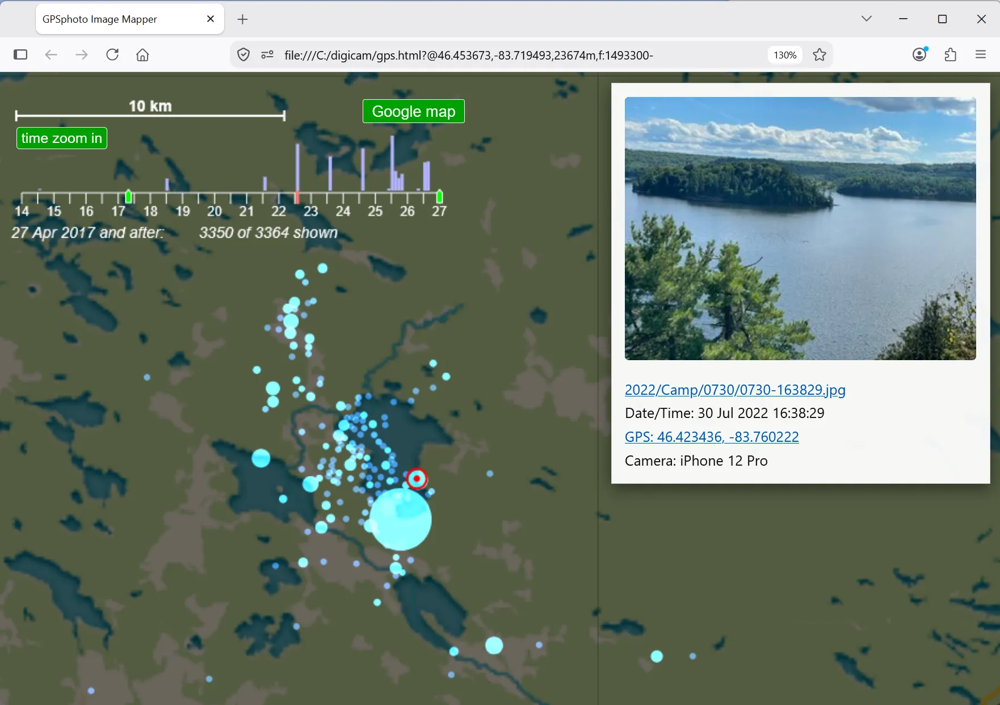
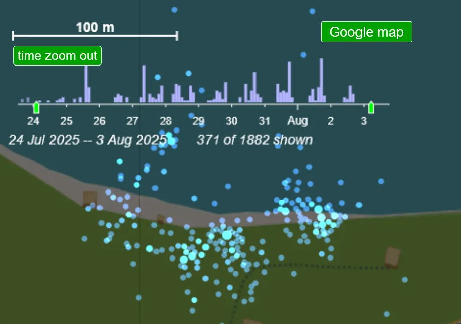
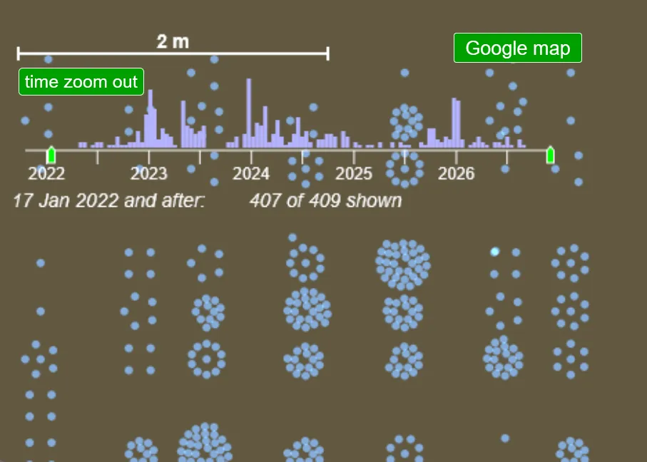

<html>
<body>
<h1>A HTML / Javascript program for browsing large sets of images with GPS taggs (downloaded from phones) on a map</h1>

There is also a video about this: <a href="https://youtu.be/xxxxxxxxxxx">https://youtu.be/xxxxxxxxxxx</a>

I like how phones can show heatmaps of where photos were taken on a map, but my photo collection on my PC encompasses many photos taken on many different devices.  I wanted to browse photos by location on my PC, so I wrote this program.

This all started by challenging AI (Google Gemini) to write such a program, and over the ensuing months I have refined it and added features, mostly by inspecting the code and asking for specific changes or implementing them myself.

The program is intended to be run locally on your computer, all you need is the "gps.html" and "gathergps.html" files and place them inot the root directory of your photo collection.

As scanning  thousands of files every time the page is loaded would take very long, the program loads a file containing pre-gathered metadata for all images from a file "gpstagged.js".  This file is created by "gathergps.html".  Due to various security limitations of html / javascript, gathergps.html needs you to browse to the root of your image tree.  After gathering all the metadata, it will download "gpstagged.js", but this file must subsequently be manually copied to the root of your images, right next to gps.html.

For my own photo collection of 160,000 photos, only 10% have GPS coordinats, and I use "gathergps.py", but this python program assumes the files are organized the way they are on my computer.

<b>Typcal view of GPSphoto</b> 

 
The large circle on this view represents sevral thousand images at the family camp.
Unfortunately phones will often use a guess for the Lat/Lon coordinates if they don't have a GPS fix when the photo was taken.  This guess is often based on the current celltwoer / cell tha the phone is connected to.  The guess can be several kilometers off.  The circles towards the top left are mostly guesses.

Im my experience iPhones are less likely to just put in a guess.
If you are taking photos and want to make sure they have actual coordinates, you can go into maps before hand to make sure the phone gets a fix, or you can tell the phone to navigate to somewhere, at which point it will do its best to maintain a GPS fix while navigation is active.

Images can be selected by clicking on them with a mouse.  Pan and zoom are done by dragging the map or rolling the mouse wheel.  You can also pinch in and out on mobile.

Images can be selected by clicking on them.  Large clusters of images will resolve into smaller clusters and eventually individual images as you zoom in on them.

At the top left is a scale bar indicating the map scale, plus a button to pop up the same map (without the image dots) on google maps.

<b>Zoomed in on just a few days</b> 

 
Below the scale bar is a time-scale and histogram of when images were taken.  You can drag the green sliders on the time scale to limit the images shown to a certain time range.  You can also zoom in on the time scale between the markers uisng the "time zoom in" button.  By successively zoomoin in, you can zoom the time scale to just a few days.

<b>Zoomed in on ust a few meters in a high geographic photo density area</b> 

 
This is zoomed in on the area of our house.  Due to coordinate rounding, many images may fall on the exact same Lat/Lon coordinates.  To still enable selecting individual images, for high level of zoom, some "jitter" is added to the displayed X,Y coordinates so that they appear as circles or spirals of coordinates.  Note that the Lat/Lon of selected images is not altered, only where the dot for the image is shown.

If you want to make changes to the program using AI, it helps to also have AI ingest the file "what it does.txt" to help it figure out what the program is all about.

